# Dev Overflow

A modern Q&A platform for developers.

## Project Structure Flow Chart

```mermaid
graph TD
    1[App Entry] --> 2[app/]
    2 --> 3[Pages & Routes]
    2 --> 4[API Routes]
    2 --> 5[Auth Routes]

    6[Components] --> 7[UI Components]
    6 --> 8[Feature Components]
    6 --> 9[Layout Components]

    10[Database] --> 11[Models]
    10 --> 12[Configurations]
    10 --> 13[Utilities]

    14[Lib] --> 15[Helpers]
    14 --> 16[Utilities]
    14 --> 17[Shared Code]

    18[Types] --> 19[Type Definitions]
    18 --> 20[Interfaces]
    18 --> 21[Type Utilities]

    22[Context] --> 23[State Management]
    22 --> 24[Global Context]

    25[Public] --> 26[Static Assets]
    25 --> 27[Images]
    25 --> 28[Fonts]

    29[Constants] --> 30[App Constants]
    29 --> 31[Configuration]

    32[.next] --> 33[Build Output]
    32 --> 34[Cache]
```

## Directory Structure

- `app/` - Core application code and routes
- `components/` - Reusable React components
- `database/` - Database configurations and models
- `lib/` - Utility functions and helpers
- `types/` - TypeScript type definitions
- `context/` - React context providers
- `public/` - Static assets
- `constants/` - Application constants
- `.next/` - Next.js build output

## Getting Started

1. Clone the repository
2. Install dependencies: `npm install`
3. Set up environment variables
4. Run the development server: `npm run dev`

## Features

- Modern Q&A platform for developers
- Real-time updates
- Rich text editing
- Search functionality
- User authentication
- Responsive design

## Tech Stack

- Next.js 13+
- TypeScript
- Tailwind CSS
- Prisma
- PostgreSQL
- React Query
- Shadcn UI

This is a [Next.js](https://nextjs.org) project bootstrapped with [`create-next-app`](https://nextjs.org/docs/app/api-reference/cli/create-next-app).

Open [http://localhost:3000](http://localhost:3000) with your browser to see the result.

You can start editing the page by modifying `app/page.tsx`. The page auto-updates as you edit the file.

This project uses [`next/font`](https://nextjs.org/docs/app/building-your-application/optimizing/fonts) to automatically optimize and load [Geist](https://vercel.com/font), a new font family for Vercel.

## Learn More

To learn more about Next.js, take a look at the following resources:

- [Next.js Documentation](https://nextjs.org/docs) - learn about Next.js features and API.
- [Learn Next.js](https://nextjs.org/learn) - an interactive Next.js tutorial.

You can check out [the Next.js GitHub repository](https://github.com/vercel/next.js) - your feedback and contributions are welcome!

## Deploy on Vercel

The easiest way to deploy your Next.js app is to use the [Vercel Platform](https://vercel.com/new?utm_medium=default-template&filter=next.js&utm_source=create-next-app&utm_campaign=create-next-app-readme) from the creators of Next.js.

Check out our [Next.js deployment documentation](https://nextjs.org/docs/app/building-your-application/deploying) for more details.
